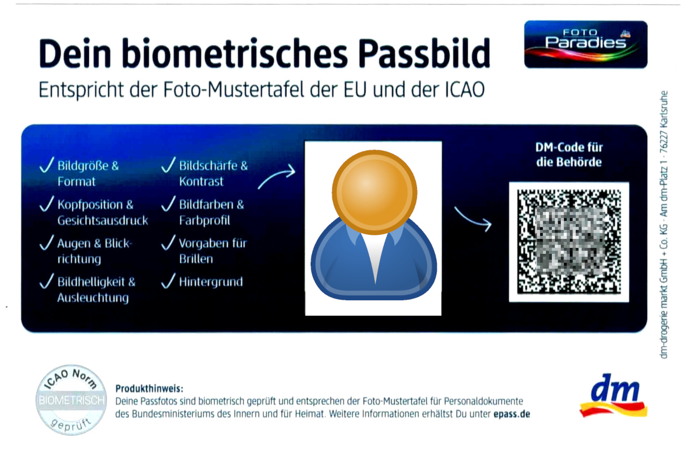
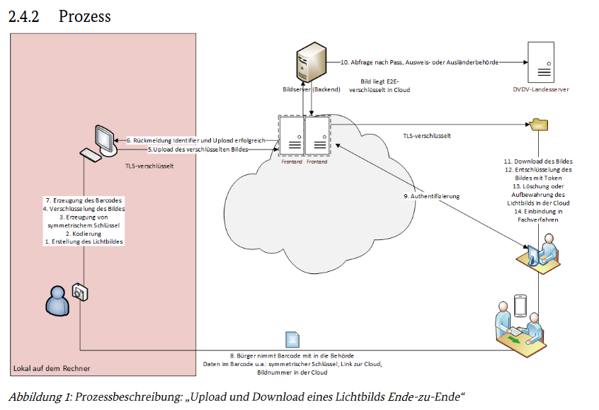

# e-passfoto-TR-03170

This is an implementation of a Datamatrix C40 Decoder (for the field "Encryption algorithm" OID decoding) to make the content of german foto transport visible.

If you have such a barcode, take the base64 String and input it here: https://jsfiddle.net/7scae63x/

## example layout



## process description




https://www.bsi.bund.de/SharedDocs/Downloads/DE/BSI/Publikationen/TechnischeRichtlinien/TR03170/BSI_TR_03170_Rahmendokument.pdf?__blob=publicationFile&v=7

## example decodings:
```
epassfoto_p: {
  "cloudUrl": "https://image-download.prod.imagesign.link",
  "lbID": "55e770ca-e5b2-4517-8daf-e1ef844b3b9e",
  "schlAlgOID": "2.16.840.1.101.3.4.1.46",
  "schlAlgTxt": "aes256-GCM",
  "initVec": "af82e8300d66b9bf53e69922",
  "pad": "",
  "key": "b86344cab7917717f4f99a3144f1ed71509f832ed32ff1989c6b32ba68ec4525"
}
```


```
epassfoto_p: {
  "cloudUrl": "https://d.biometric-photos-prod.aws.dmtech.cloud",
  "lbID": "096c1e7b-46ac-44d5-9cc3-042b8ba4bbe6",
  "schlAlgOID": "2.16.840.1.101.3.4.1.42",
  "schlAlgTxt": "aes256-CBC-PAD",
  "initVec": "f3ca192f9e4060ff0d4ec4c716733c81",
  "pad": "0f0345140f7a4c69",
  "key": "744a24f395c09be8c414407580013b8f25c8b2de3273798a7453b6bb42927972"
}
```

## What the heck?

It looks like the protocol at the last minute added a wrap of the complete payload in base64.
While the encryption Algorithm (OID) is encoded in C40 (which can save bytes if you have uppercase letters and Numbers, but *not dots*),
it is cumbersome. 

All that to save _1 byte_ in the examples I have seen. Which is easily made up for when the vendors use such long urls and waste the bytes.
What bothers me even more, they kept the C40 encoding and it gets wrapped in base64!!1!
And now, because everything is base64-wrapped, you have to en/decode the C40 in software, because you cannot rely (anymore?) on the barcode decoder/encoder.

```
example OID: 2.16.840.1.101.3.4.1.46 (aes256-GCM)
C40 encoded, hex:
0x 25b6 20d2 5329 1936 1f76 1fe6 0850 0851 084e 0851 fe37

Ascii, hex
   2 .  1 6  . 8  4 0  . 1  . 1  0 1  . 3  . 4  . 1  . 4  6
0x 322e 3136 2e38 3430 2e31 2e31 3031 2e33 2e34 2e31 2e34 36
i.e. just 1 byte more!
```

## Code example C40 decoder
```
console.assert(
    c40dec(hexToByte("25b6 20d2 5329 1936 1f76 1fe6 0850 0851 084e 0851 fe37")) === "2.16.840.1.101.3.4.1.46"
); // ringfoto
```


### Publicly seen DVDV certificates (public part!)

```
$ echo "" |openssl s_client -showcerts image-download.prod.imagesign.link:443 | openssl crl2pkcs7 -nocrl -certfile /dev/stdin | openssl pkcs7 -noout -print_certs -text
Certificate:
    Data:
        Version: 3 (0x2)
        Serial Number:
            80:2d:21:49:ae:8b:fd:65
        Signature Algorithm: sha256WithRSAEncryption
        Issuer: C=DE, O=PKI-1-Verwaltung, OU=DOI, CN=DOI CA 13
        Validity
            Not Before: Apr  3 13:17:20 2025 GMT
            Not After : Apr  3 23:59:59 2026 GMT
        Subject: C=DE, O=Service, OU=Externe Partner der Verwaltungen, CN=image-download.prod.imagesign.link
        Subject Public Key Info:
            Public Key Algorithm: rsaEncryption
                Public-Key: (4096 bit)
          X509v3 extensions:
            X509v3 Authority Key Identifier: 
                keyid:11:4B:2A:B2:23:18:28:8E:F6:3A:B3:FE:DE:DC:41:44:8B:C0:91:3A
                DirName:/C=DE/O=PKI-1-Verwaltung/CN=PCA-1-Verwaltung-23
                serial:F7:B2:5B:F4
            X509v3 CRL Distribution Points: 
                Full Name:
                  URI:ldap://x500.bund.de/CN=DOI%20CA%2013,OU=DOI,O=PKI-1-Verwaltung,C=DE?certificateRevocationList
                  URI:ldap://pki-directory.doi-de.net/CN=DOI%20CA%2013,OU=DOI,O=PKI-1-Verwaltung,C=DE?certificateRevocationList
                  URI:http://x500.bund.de/cgi-bin/show_attr?cn=DOI%20CA%2013&attr=crl
            X509v3 Certificate Policies: 
                Policy: 0.4.0.127.0.7.3.6.1.1.5.3
            X509v3 Key Usage: critical
                Digital Signature, Key Encipherment
            X509v3 Extended Key Usage: 
                TLS Web Client Authentication, TLS Web Server Authentication
            Authority Information Access: 
                OCSP - URI:http://ocsp.doi.telesec.de/ocspr
            X509v3 Subject Alternative Name: 
                email:exxx, DNS:image-download.prod.imagesign.link


$ echo "" |openssl s_client -showcerts d.biometric-photos-prod.aws.dmtech.cloud:443 | openssl crl2pkcs7 -nocrl -certfile /dev/stdin | openssl pkcs7 -noout -print_certs -text
depth=2 C = DE, O = PKI-1-Verwaltung, CN = PCA-1-Verwaltung-23
verify error:num=19:self-signed certificate in certificate chain
verify return:1
depth=2 C = DE, O = PKI-1-Verwaltung, CN = PCA-1-Verwaltung-23
verify return:1
depth=1 C = DE, O = PKI-1-Verwaltung, OU = DOI, CN = DOI CA 13
verify return:1
depth=0 C = DE, O = Service, OU = Externe Partner der Verwaltungen, L = Karlsruhe, CN = d.biometric-photos-prod.aws.dmtech.cloud
verify return:1
DONE
Certificate:
    Data:
        Version: 3 (0x2)
        Serial Number:
            81:bc:94:bf:4d:2b:da:30
        Signature Algorithm: sha256WithRSAEncryption
        Issuer: C=DE, O=PKI-1-Verwaltung, OU=DOI, CN=DOI CA 13
        Validity
            Not Before: Apr  8 05:01:45 2025 GMT
            Not After : Apr  8 23:59:59 2026 GMT
        Subject: C=DE, O=Service, OU=Externe Partner der Verwaltungen, L=Karlsruhe, CN=d.biometric-photos-prod.aws.dmtech.cloud
        Subject Public Key Info:
            Public Key Algorithm: rsaEncryption
                Public-Key: (3072 bit)
                Exponent: 65537 (0x10001)
        X509v3 extensions:
            X509v3 Authority Key Identifier: 
                keyid:11:4B:2A:B2:23:18:28:8E:F6:3A:B3:FE:DE:DC:41:44:8B:C0:91:3A
                DirName:/C=DE/O=PKI-1-Verwaltung/CN=PCA-1-Verwaltung-23
                serial:F7:B2:5B:F4
            X509v3 CRL Distribution Points: 
                Full Name:
                  URI:ldap://x500.bund.de/CN=DOI%20CA%2013,OU=DOI,O=PKI-1-Verwaltung,C=DE?certificateRevocationList
                  URI:ldap://pki-directory.doi-de.net/CN=DOI%20CA%2013,OU=DOI,O=PKI-1-Verwaltung,C=DE?certificateRevocationList
                  URI:http://x500.bund.de/cgi-bin/show_attr?cn=DOI%20CA%2013&attr=crl
            X509v3 Certificate Policies: 
                Policy: 0.4.0.127.0.7.3.6.1.1.5.3
            X509v3 Key Usage: critical
                Digital Signature, Key Encipherment
            X509v3 Extended Key Usage: 
                TLS Web Client Authentication, TLS Web Server Authentication
            Authority Information Access: 
                OCSP - URI:http://ocsp.doi.telesec.de/ocspr
            X509v3 Subject Alternative Name: 
                email:xx, DNS:d.biometric-photos-prod.aws.dmtech.cloud
    Signature Algorithm: sha256WithRSAEncryption

Certificate:
    Data:
        Version: 3 (0x2)
        Serial Number: 4155661300 (0xf7b25bf4)
        Signature Algorithm: sha256WithRSAEncryption
        Issuer: C=DE, O=PKI-1-Verwaltung, CN=PCA-1-Verwaltung-23
        Validity
            Not Before: Nov  3 00:00:00 2024 GMT
            Not After : Nov  4 23:59:59 2030 GMT
        Subject: C=DE, O=PKI-1-Verwaltung, OU=DOI, CN=DOI CA 13
        Subject Public Key Info:
            Public Key Algorithm: rsaEncryption
                Public-Key: (4096 bit)
                Exponent: 65537 (0x10001)
        X509v3 extensions:
            X509v3 Basic Constraints: critical
                CA:TRUE, pathlen:3
            X509v3 Certificate Policies: 
                Policy: 0.4.0.127.0.7.3.6.1.1.5.3
                  CPS: https://www.bsi.bund.de
            X509v3 Key Usage: critical
                Certificate Sign, CRL Sign
            X509v3 Subject Key Identifier: 
                11:4B:2A:B2:23:18:28:8E:F6:3A:B3:FE:DE:DC:41:44:8B:C0:91:3A
            X509v3 Authority Key Identifier: 
                keyid:9D:81:A8:57:18:90:B9:59:F4:B3:93:A3:AA:BE:2C:BA:84:F4:19:C6
                DirName:/C=DE/O=PKI-1-Verwaltung/CN=PCA-1-Verwaltung-23
                serial:A5:EF:92:30
            X509v3 CRL Distribution Points: 
                Full Name:
                  URI:ldap://x500.bund.de/CN=PCA-1-Verwaltung-23,O=PKI-1-Verwaltung,C=DE?certificateRevocationList
                Full Name:
                  URI:http://x500.bund.de/cgi-bin/show_attr?cn=PCA-1-Verwaltung-23&attr=crl
    Signature Algorithm: sha256WithRSAEncryption

Certificate:
    Data:
        Version: 3 (0x2)
        Serial Number: 2783941168 (0xa5ef9230)
        Signature Algorithm: sha256WithRSAEncryption
        Issuer: C=DE, O=PKI-1-Verwaltung, CN=PCA-1-Verwaltung-23
        Validity
            Not Before: Dec  1 00:00:00 2022 GMT
            Not After : Dec 31 23:59:59 2032 GMT
        Subject: C=DE, O=PKI-1-Verwaltung, CN=PCA-1-Verwaltung-23
        Subject Public Key Info:
            Public Key Algorithm: rsaEncryption
                Public-Key: (4096 bit)
                Exponent: 65537 (0x10001)
        X509v3 extensions:
            X509v3 Basic Constraints: critical
                CA:TRUE
            X509v3 Certificate Policies: 
                Policy: 0.4.0.127.0.7.3.6.1.1.1.4
                  CPS: https://www.bsi.bund.de
            X509v3 CRL Distribution Points: 
                Full Name:
                  URI:ldap://x500.bund.de/CN=PCA-1-Verwaltung-23,O=PKI-1-Verwaltung,C=DE?certificateRevocationList
                Full Name:
                  URI:http://x500.bund.de/cgi-bin/show_attr?cn=PCA-1-Verwaltung-23&attr=crl
            X509v3 Key Usage: critical
                Certificate Sign, CRL Sign
            X509v3 Subject Key Identifier: 
                9D:81:A8:57:18:90:B9:59:F4:B3:93:A3:AA:BE:2C:BA:84:F4:19:C6
            X509v3 Subject Alternative Name: 
                email:V-PKI@bsi.bund.de, URI:https://www.bsi.bund.de
    Signature Algorithm: sha256WithRSAEncryption
```
